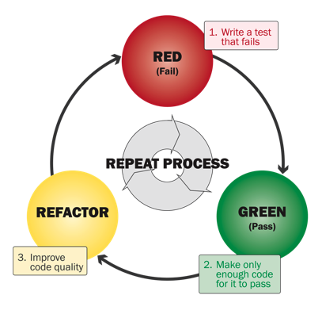

# Test-Driven Development

Test Driven Development is a programming methodology that says you should write your code one unit test at a time, working in short cycles to write your code one small step at a time:

## Red, Green, Refactor

1. **Red**: Run the tests and see which ones fail. Failing tests are not a personal failure, they're helpful information!
   By carefully noting which tests pass and which ones fail you can build an understanding of what you need to fix in your code.
2. **Green**: Pick a specific failing test that you want to pass, only one! Working in small increments is the safest way to go. Make a small change or add a tiny bit of code and run the tests again.
   - You might find it helpful to create a new function instead of constantly changing the old one.
     You can start from scratch by copy-pasting the stub or you can copy-paste your last attempt and modify it.
     This way you can easily return to and old version, study the ideas you've tried so far,
     or copy-paste snippets from old functions into your newest attempt.
3. **Refactor**: After passing your chosen test, take a step back and revaluate your code.
   Make some changes so it's easier to read and understand (but don't try to pass any new tests!).
   - Add some comments above your latest solution describing what worked and what didn't.
   - Consider adding more tests: does your code have a bug that wasn't caught? did you find a new use-case that wasn't covered?
   - Use comments in your function to point out important steps in your implementation.
   - Change variable names to be make it more clear what role they play and how they are used.
   - At this step in the workflow your file may get long and messy. To keep things easy to read, you can collapse functions you're not working on, and delete ones that you're finished learning from.
   - After revising your code, take a second to revise your strategy. Maybe you notice that the way you wanted to solve the problem isn't possible!
4. Go to step 1 (repeat!)
